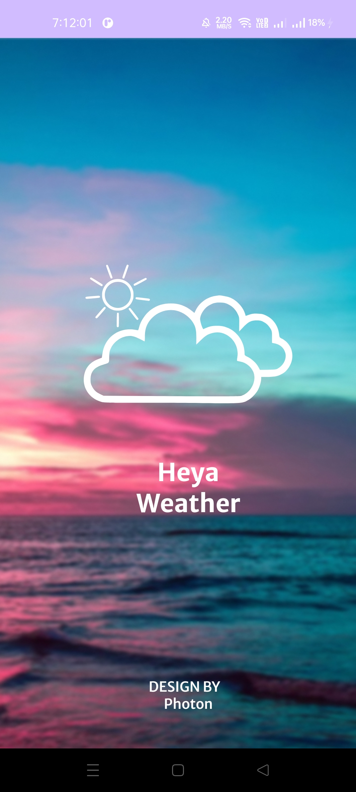
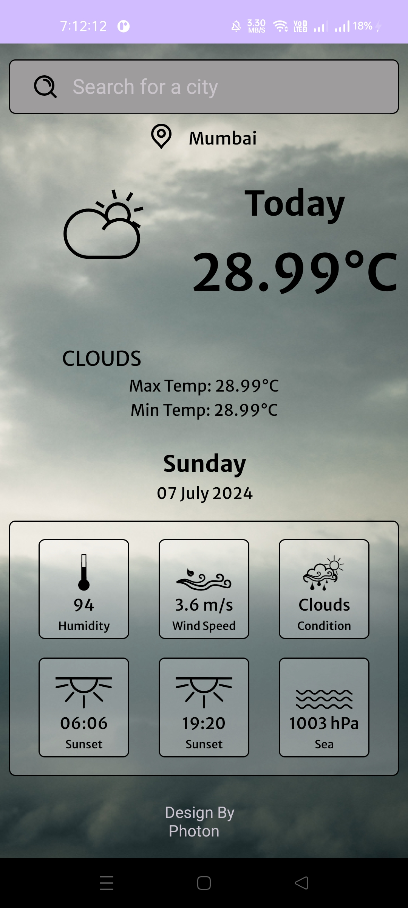
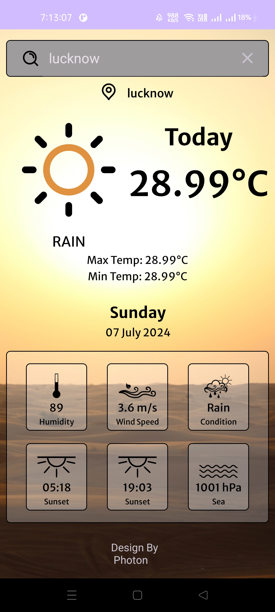

# Weather App

## Introduction

Welcome to the Weather App! This application provides real-time weather information for any location worldwide. Stay updated with the latest weather conditions, forecasts, and more.

## Features

1. Real-time weather updates
2. 7-day weather forecast
3. Search for weather by city or GPS location
4. Detailed weather information including temperature, humidity, wind speed, and more
5. User-friendly and responsive design

## Usage

1. Open the app on your Android device.
2. Enter a city name in the search bar or use the GPS location button to get weather information for your current location.
3. View the current weather and forecast.

## Screenshots

|  |  |  |
| ---------------------------------------------- | -------------------------------------------- | ------------------------------------------- |

## Technologies Used

- Kotlin
- Android SDK
- Retrofit
- OpenWeatherMap API
- Material Design

## Contributing

Contributions are welcome! Please follow these steps to contribute:

1. **Fork the repository**
2. Create a new branch (`git checkout -b feature/your-feature`).
3. Make your changes.
4. Commit your changes (`git commit -m 'Add some feature'`).
5. Push to the branch (`git push origin feature/your-feature`).
6. Open a pull request.

## Contact

For any inquiries, please contact:

- Your Name - [your.email@example.com](mailto:your.email@example.com)
- GitHub: [AnandY4d4v](https://github.com/AnandY4d4v)

